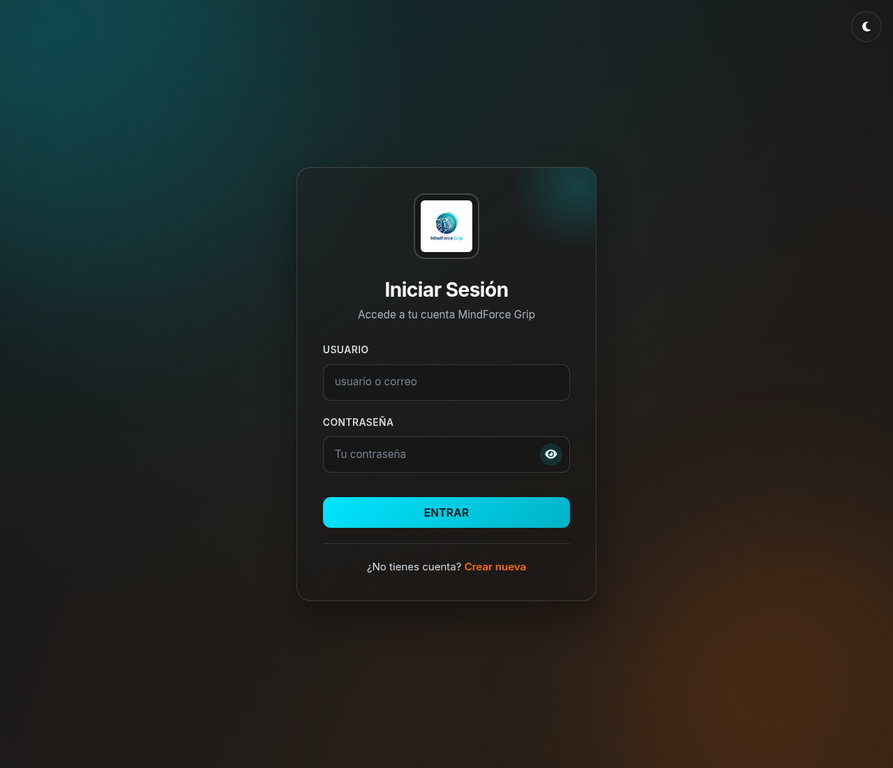
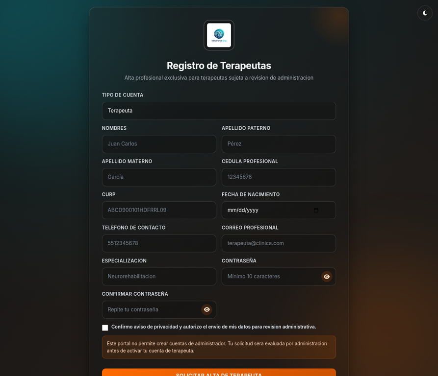
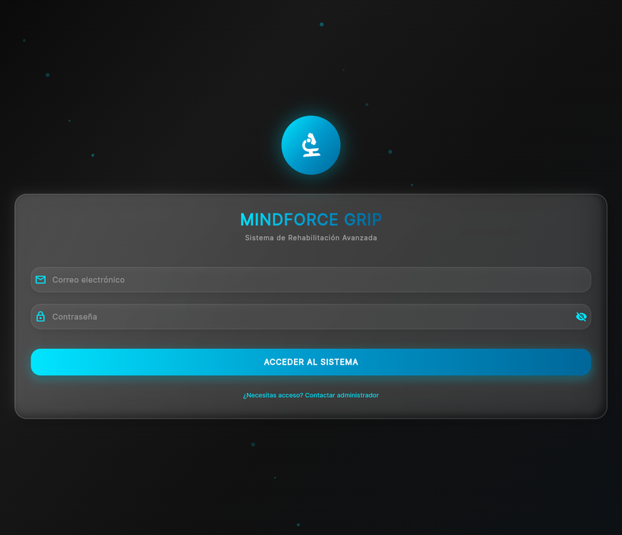
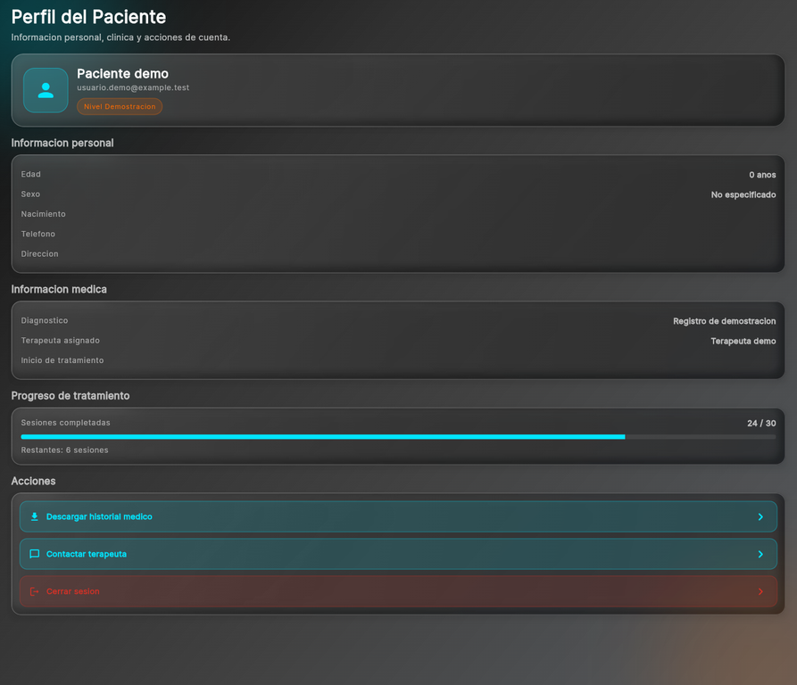

# MindForce Grip

<p align="center">
  
</p>

<p align="center"><strong>Plataforma web y móvil para la gestión y visualización de información de rehabilitación motriz.</strong></p>

MindForce Grip es un prototipo académico compuesto por una aplicación web y una aplicación móvil Flutter. El proyecto organiza interfaces para inicio de sesión, registro de terapeutas, administración de pacientes, agenda y visualización de métricas de seguimiento. Su propósito es explorar una experiencia de software que conecte interfaz, servicios, persistencia de datos y datos provenientes de procesos de rehabilitación.

> Este repositorio contiene únicamente datos de demostración anonimizados. MindForce Grip no debe utilizarse como sustituto de valoración, diagnóstico, prescripción o tratamiento clínico profesional.

## Vista rápida

| Inicio de sesión | Registro de terapeutas |
|---|---|
|  |  |

## Evidencias de ejecución

Las siguientes capturas fueron obtenidas ejecutando las aplicaciones con datos de demostración anonimizados. Se incluyen la pantalla de acceso móvil y el perfil móvil porque muestran el flujo de entrada, el seguimiento del progreso y las acciones disponibles para el paciente.

| Acceso móvil | Perfil móvil y exportación |
|---|---|
|  |  |

## Reportes PDF

La exportación de historial está implementada en la aplicación móvil dentro de `PacientePerfilScreen`. La acción **Descargar historial médico** construye un documento mediante el paquete `pdf` y abre el flujo de impresión o guardado mediante `printing`. El panel web documentado en este repositorio gestiona los flujos web de acceso, registro y administración; no se presenta como generador PDF para evitar atribuirle una capacidad que no está implementada en esa interfaz.


| Vista previa del historial generado |
|---|
|  |

La vista previa corresponde al documento PDF generado con los mismos campos mostrados en la pantalla de perfil y con datos de demostración anonimizados. Puedes consultar el archivo resultante en [historial-mindforce-demo.pdf](docs/screenshots/historial-mindforce-demo.pdf).
## Estructura del proyecto

```text
mindforce-grip/
├── web/                      # Aplicación web estática
│   ├── css/                  # Estilos de acceso, registro y panel
│   ├── js/                   # Lógica del dashboard y conexión opcional
│   ├── index.html            # Inicio de sesión
│   ├── register.html         # Registro de terapeutas
│   └── dashboard.html        # Panel de administración
├── mobile/                   # Aplicación Flutter
│   ├── lib/                  # Pantallas, servicios, modelos y tema
│   ├── assets/               # Recursos visuales
│   ├── android/ ios/ web/    # Plataformas soportadas
│   └── pubspec.yaml          # Dependencias Flutter
└── docs/screenshots/         # Capturas reales de la aplicación web
```

## Funcionalidades documentadas

| Área | Alcance actual |
|---|---|
| **Acceso web** | Inicio de sesión, alternancia de tema y recuperación visual de formularios. |
| **Alta de terapeutas** | Registro profesional sujeto a revisión administrativa y validaciones de campos. |
| **Panel web** | Gestión de terapeutas, pacientes, citas, perfiles, estados locales y visualización de indicadores. |
| **Aplicación móvil** | Inicio de sesión, perfil de paciente, agenda, entrenamiento, métricas y exportación de historial en PDF. |
| **Datos** | Integración opcional con Supabase para servicios de autenticación y persistencia. |

## Tecnologías

| Aplicación web | Aplicación móvil |
|---|---|
| HTML5, CSS3 y JavaScript | Flutter y Dart |
| Bootstrap 5 y Font Awesome | Material, Google Fonts y Provider |
| Chart.js y FullCalendar | Supabase Flutter, `http` e `intl` |
| Supabase JavaScript | `shared_preferences`, PDF y Printing |

## Ejecutar la aplicación web

La aplicación web es estática. Desde la raíz del repositorio, sirve la carpeta `web` con cualquier servidor local.

```bash
npx serve web
```

Abre la dirección local indicada por el servidor. Las pantallas principales son `index.html`, `register.html` y `dashboard.html`.

## Ejecutar la aplicación móvil

La aplicación requiere Flutter compatible con Dart `>=3.2.3 <4.0.0`.

```bash
cd mobile
flutter pub get
flutter run \
  --dart-define=SUPABASE_URL="https://TU_PROYECTO.supabase.co" \
  --dart-define=SUPABASE_ANON_KEY="TU_CLAVE_ANON"
```

La configuración móvil se recibe mediante `--dart-define`. No se incluyen claves, contraseñas ni endpoints de terceros en el repositorio.

## Configurar Supabase en la web

Si deseas habilitar persistencia y autenticación en la aplicación web, define los valores de tu propio proyecto en `web/js/supabase-config.js`:

```js
window.MIND_FORCE_SUPABASE = {
  url: 'https://TU_PROYECTO.supabase.co',
  anonKey: 'TU_CLAVE_ANON',
};
```

Antes de conectar un entorno real, configura reglas de acceso a nivel de fila, separa los roles administrativos y evita colocar claves con privilegios elevados en código del cliente.

## Consideraciones de privacidad

Los registros iniciales fueron reemplazados por perfiles y datos de demostración no identificables. Para un entorno real, evita versionar datos personales, historiales clínicos, teléfonos, direcciones, credenciales o exportaciones. Usa variables de entorno, controles de acceso y una política de retención de datos acorde al contexto de despliegue.

## Autoría

Este proyecto está mantenido por **José Francisco Ortiz Baylón / [xFrankB](https://github.com/xFrankB)**. El historial del repositorio se inicializó con una única identidad de autor.
